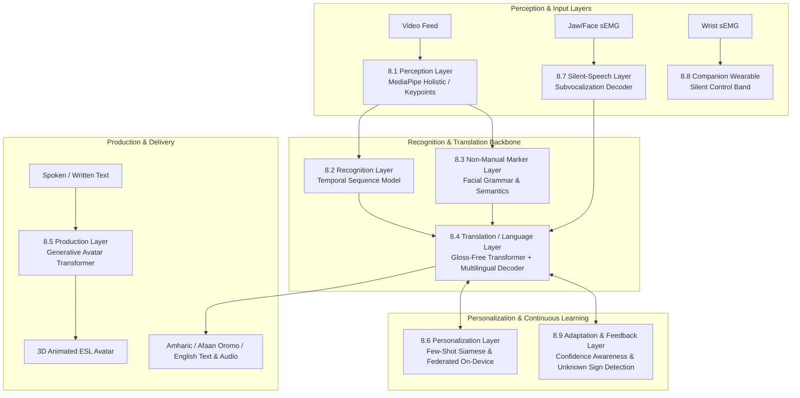

# Tereguwami — ተርጓሚ
### An Adaptive Multimodal AI System for Two-Way Communication Between Ethiopian Sign Language Users and Non-Signers

[](LICENSE)
[]()
[]()

---

## 1. Overview

**Tereguwami** (ተርጓሚ, Amharic for *"the translator/interpreter"*) is the first open, benchmarked, bidirectional communication system designed for **Ethiopian Sign Language (ESL / ETHSL)**. It bridges communication barriers between Deaf/hard-of-hearing individuals and hearing non-signers across vital public and private domains: healthcare, education, legal proceedings, banking, public broadcasts, and everyday life.

Tereguwami unifies four core research threads into a single deployed accessibility platform:
1. **Continuous, Non-Manual-Marker-Aware Translation**: Sentence-level recognition mapping hands, body pose, and facial grammatical markers (eyebrow, mouth, head movements) into fluent Amharic, Afaan Oromo, and English.
2. **Generative Sign Production (Reverse Channel)**: Continuous avatar performance generated directly from text/speech using sequence transformers.
3. **Non-Invasive Neuromuscular "Silent Speech" Channel**: AlterEgo-derived sEMG decoding from facial/jaw subvocalizations for camera-free communication in low-light, occupied-hand, or privacy-sensitive contexts.
4. **Companion Wearable Control Interface**: Wrist-worn surface-EMG band for hands-free, silent command and control.

---

## 2. Nine-Layer System Architecture



---

## 3. Technology Stack

| Layer | Technology |
|---|---|
| **Computer Vision / Perception** | MediaPipe Holistic, OpenCV |
| **Model Development** | PyTorch, HuggingFace Transformers |
| **Personalization / Metric Learning** | Siamese / Prototypical Networks, Flower (Federated Learning) |
| **Backend Services** | Python, FastAPI |
| **Real-Time Transport** | WebRTC, WebSockets |
| **Data Storage** | PostgreSQL (metadata, profiles), Object Storage (video, model artifacts) |
| **Mobile & Edge** | Android & iOS clients, ONNX Runtime Mobile, TensorFlow Lite |
| **Wearable Firmware** | Embedded C/C++ on low-power MCU with analog front-end (AFE) sEMG |
| **Avatar Rendering** | Real-time 3D rendering (WebGL / Unity) driven by generated pose sequences |
| **Evaluation / Leaderboard** | Containerized submission & scoring engine (BLEU-4, signer-independent accuracy) |
| **Infrastructure** | Cloud GPU training cluster + edge-optimized deployment |

---

## 4. Repository Structure

```
tereguwami/
├── docs/                        # Architecture specs, proposals, dataset cards, governance docs
├── data/                        # Datasets, processed keypoints, annotations, and train/val/test splits
├── research/                    # Research notebooks, experiment tracking configs, publication papers
├── models/                      # Deep learning model architectures (perception to silent-speech)
├── backend/                     # FastAPI backend services, streaming WebRTC pipelines, auth, DB
├── mobile/                      # Android, iOS applications and cross-platform shared components
├── firmware/                    # Embedded C/C++ code for the sEMG wristband and AFE hardware
├── avatar/                      # 3D rigging definitions and WebGL/Unity avatar rendering engines
├── evaluation/                  # Benchmark evaluation suites and competitive leaderboard server
├── infra/                       # Edge deployment packaging and cloud GPU orchestration manifests
└── governance/                  # Deaf advisory board charters, consent forms, data-use agreements
```

---

## 5. Development Roadmap & Technology Readiness Levels (TRL)

- **Phase 0 — Foundations (TRL 3–4)**: Perception pipeline, ~10–15 signer pilot data collection, Deaf advisory board establishment.
- **Phase 1 — Isolated Recognition Baseline (TRL 4)**: Small-vocabulary isolated ESL recognizer, reproducing & exceeding 2025 Ethiopian baselines.
- **Phase 2 — Continuous Translation (TRL 4–5)**: Gloss-free transformer with cross-lingual pretraining; sentence-level translation; BLEU-4 evaluation.
- **Phase 3 — Non-Manual Markers (TRL 4)**: High-resolution facial semantics fused as first-class input; ablation validations.
- **Phase 4 — Personalization (TRL 4)**: Few-shot personal gesture enrollment; federated on-device adaptation.
- **Phase 5 — Reverse Channel (TRL 3–4)**: Generative avatar pose sequence generation; bidirectional conversation UI.
- **Phase 6 — Silent-Speech Prototype (TRL 2–3)**: AlterEgo-derived jaw/face sEMG wearable; closed-vocabulary calibration.
- **Phase 7 — Institutional Pilots (TRL 5–6)**: Broadcaster, telecom relay, healthcare/court pilots; public benchmark release.

---

## 6. Community & Ethical Governance

Tereguwami is governed in active partnership with the Ethiopian Deaf community. All data collection follows strict consent and withdrawal protocols under the oversight of a Deaf-led Advisory Board. Raw video data is strictly access-controlled and never committed to version control.
